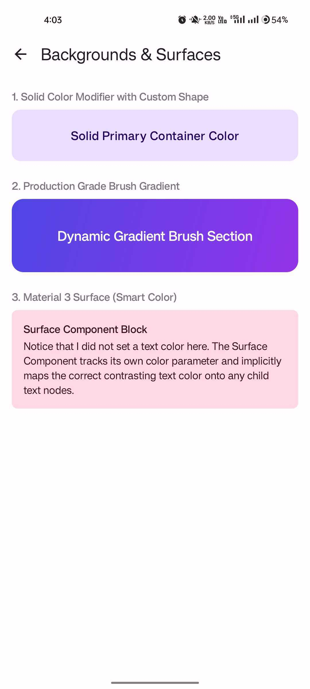
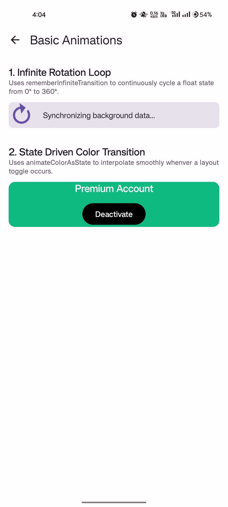

# Jetpack Compose Practice 🚀

Welcome to the **Jetpack Compose Practice**! This repository is a curated, hands-on learning library built to demonstrate production-grade implementation patterns in Jetpack Compose. Instead of simple "Hello World" code blocks, this project tackles real-world layout architectures, optimization strategies, and engineering design tokens.

The project structure is driven by a data-driven menu engine utilizing modern **Type-Safe Navigation** and central dependency tracking via a Gradle **Version Catalog (`libs.versions.toml`)**.

---

## 🛠 Tech Stack & Architecture Foundations
* **Language:** 100% Kotlin
* **UI Engine:** Jetpack Compose (Material 3 Specification)
* **Architecture:** Unidirectional Data Flow (UDF) & Semantic Design Tokens
* **Navigation:** Jetpack Navigation Component (Modern Type-Safe Serializable Routing)
* **Build System:** Gradle Kotlin DSL with Centralized Version Catalogs

---

## 📱 Module 1: General Basics & Layout Core

This module focuses on the absolute fundamentals of layout composition, structural drawing boundaries, and interaction behaviors. Click on any example link to view its core source code implementation.

### Architectural Feature Index

| Example Feature | Technical Concept Covered | Screen Preview |
| :--- | :--- | :--- |
| [**1. Static & Dynamic Text Presentation**](app/src/main/java/com/anshul1507/composesamplefirst/practice/ui/screens/general/SimpleTextScreen.kt) | Standard layout text rendering using localized string interpolation and core `MaterialTheme.typography` design token integration. |  |
| [**2. Clickable Views & Interaction Sinks**](app/src/main/java/com/anshul1507/composesamplefirst/practice/ui/screens/general/ClickableScreen.kt) | Interactive execution states using `Modifier.clickable`, accessibility management (`enabled` flags), and handling silent inputs via `MutableInteractionSource`. |  |
| [**3. Layout Modifiers Engine**](app/src/main/java/com/anshul1507/composesamplefirst/practice/ui/screens/general/LayoutModifiersScreen.kt) | Spacing systems via sequential order-of-execution modifiers, floating visual layers (`.offset()`), and locking aspect dimensions using `.aspectRatio()`. |  |
| [**4. Backgrounds & Canvas Surfaces**](app/src/main/java/com/anshul1507/composesamplefirst/practice/ui/screens/general/BackgroundColorScreen.kt) | Painting solid container vectors, implementing linear gradient design brushes, and using semantic, dark-mode aware `Surface` nodes. |  |
| [**5. FrameLayout Layering Stacks**](app/src/main/java/com/anshul1507/composesamplefirst/practice/ui/screens/general/BoxStackingScreen.kt) | Building overlapping layouts inside a `Box`, positioning components with explicit child alignments, and optimizing bounds via `matchParentSize()`. |  |
| [**6. Micro-Interactions & Animations**](app/src/main/java/com/anshul1507/composesamplefirst/practice/ui/screens/general/AnimationBasicsScreen.kt) | State-driven UI updates using lifecycle-aware `rememberInfiniteTransition` loops and smooth value-driven `animateColorAsState` transitions. |  |
| [**7. System Theme & Dark Mode Config**](app/src/main/java/com/anshul1507/composesamplefirst/practice/ui/screens/general/ThemeModeScreen.kt) | Monitoring system theme flags using `isSystemInDarkTheme()`, preventing hardcoded hex maps, and applying localized theme overrides inline. |  |
| [**8. Immersive Edge-to-Edge Windows**](app/src/main/java/com/anshul1507/composesamplefirst/practice/ui/screens/general/EdgeToEdgeScreen.kt) | Drawing directly behind the OS system status and bottom navigation layers using `enableEdgeToEdge()` and core `WindowInsets` configurations. |  |

---

## 📂 Project Structure Directory

To keep the repository clean and scalable for subsequent learning modules, the codebase uses a structured package arrangement:

```text
app/src/main/java/com/anshul1507/composesamplefirst/practice/
│
├── data/
│   └── FeatureRegistry.kt       <-- Centralized Single Source of Truth for feature indexing
│
├── navigation/
│   ├── Routes.kt                <-- Kotlinx @Serializable compile-time safe navigation routes
│   └── NavGraph.kt              <-- Master AppNavGraph orchestration hub
│
├── ui/
│   ├── screens/
│   │   ├── DashboardScreen.kt   <-- Dynamic LazyColumn landing launch menu
│   │   └── general/             <-- Module 1 code files (SimpleText, Clickable, Box, etc.)
│   │
│   └── theme/
│       ├── Color.kt             <-- Hex definitions for Light & Dark spectrums
│       ├── Theme.kt             <-- MaterialTheme wrapper orchestration
│       └── Type.kt              <-- Global Typography token configurations
│
└── ActivityMain.kt              <-- App initialization layer & setContent {} anchor
```
---

## 🏃 Setup & Installation Guide

Clone this repository directly onto your local machine:

Bash
```text
git clone https://github.com/Anshul1507/ComposeSampleFirst.git
```
* Open the project inside Android Studio (Koala or newer recommended).

* Ensure you have JDK 17 or JDK 21 selected in your Android Studio Gradle execution environments.

* Let the Gradle project sync automatically using the specified libs.versions.toml version catalog.

* Click Run (Shift + F10) to deploy the production application directly onto your target test simulator or physical hardware!
---

## 📅 Roadmap Lifecycle

[x] Module 1: General Basics, Core Layouts & Structural Modifiers (100% Completed)

[ ] Module 2: State Management Architecture, Side-Effects, and ViewModels (Next Up!)

[ ] Module 3: Rich Material Design Components & Layout Engineering

[ ] Module 4: Advanced Media Sourcing, Drawing & Custom Canvas Views

Feel free to star ⭐ this repository if you find these practical implementations helpful for your Compose journey! Contributions, issue reports, or layout optimization suggestions are always welcome.

License
-----------------

    Copyright 2026 Anshul Gupta

    Licensed under the Apache License, Version 2.0 (the "License");
    you may not use this file except in compliance with the License.
    You may obtain a copy of the License at

       http://www.apache.org/licenses/LICENSE-2.0

    Unless required by applicable law or agreed to in writing, software
    distributed under the License is distributed on an "AS IS" BASIS,
    WITHOUT WARRANTIES OR CONDITIONS OF ANY KIND, either express or implied.
    See the License for the specific language governing permissions and
    limitations under the License.
