# Jetpack Compose Practice 🚀

Welcome to the **Jetpack Compose Practice**! This repository is a curated, hands-on learning library built to demonstrate production-grade implementation patterns in Jetpack Compose. Instead of simple "Hello World" code blocks, this project tackles real-world layout architectures, optimization strategies, and engineering design tokens.

The project structure is driven by a data-driven menu engine utilizing modern **Type-Safe Navigation** and central dependency tracking via a Gradle **Version Catalog (`libs.versions.toml`)**.

---

## 🛠 Tech Stack & Architecture Foundations
* **Language:** 100% Kotlin
* **UI Engine:** Jetpack Compose (Material 3 Specification)
* **Architecture:** Unidirectional Data Flow (UDF) & Semantic Design Tokens
* **Navigation:** Jetpack Navigation Component (Modern Type-Safe Serializable Routing)
* **Build System:** Gradle Kotlin DSL with Centralized Version Catalogs

---

## 🗺️ Project Learning Path & Modules

This repository tracks my step-by-step master practice run through the Jetpack Compose architecture. It spans foundational state mechanics all the way down to custom low-level graphics painting, multi-touch gestures, and enterprise production app architecture.

Click on any module track link below to jump directly to its feature index table and source code directory mappings:

* 📥 [**Module 1: Core Layout Primitives & State Mechanics**](#-module-1-general-basics--layout-core) — *Row, Column, Box layout structures, modifier chains, and fundamental mutable state tracking properties.*
* 🔄 [**Module 2: State Management, Streams & Side-Effects**](#-module-2-state-management--side-effects) — *Configuration survival across process death, ViewModel bindings, and lifecycle-aware stream collections.*
* ⚡  [**Module 3: Material Design Components**](#-module-3-material-design-components) — *All sort of basic material design components.*
* 📊 [**Module 4: Typography, Input Fields & Visual Transformations**](#-module-4-typography-advanced) — *Custom font engines, custom text field states, SearchBar configurations, and secure input masking layers.*
* 📜 [**Module 5: Viewport Virtualization & Infinite Scroll Lists**](#-module-5-viewport-virtualization--infinite-lists) — *LazyColumn indices, spanning grid matrices, sticky section headers, and Paging 3 infinite scroll integrations.*
* 🎬 [**Module 6: Media, Asynchronous Graphics & Video Playback**](#-module-6-media-asynchronous-graphics--video-playback) — *Coil image network caches, skeleton shimmer loaders, LRU disk layers, and Media3 ExoPlayer engines.*
* 📐 [**Module 7: Advanced Layout Engineering & Constraint Ecosystems**](#-module-7-advanced-layout-engineering--constraint-ecosystems) — *Flat layout hierarchies with ConstraintLayout primitives, adaptive decoupled layouts, and Intrinsic Measurements.*
* 🎨 [**Module 8: Custom Drawing, Canvas Graphics & Gesture Systems**](#-module-8-custom-drawing-canvas-graphics--gestures) — *Canvas API vector path painting, measuring scale calibrations, multi-touch pinch zoom matrices, and raw pointer sketching.*
* 🚀 [**Module 9: Production Architecture, Enterprise Navigation & Interoperability**](#-module-9-production-architecture-enterprise-navigation--interoperability) — *Type-safe Kotlin Serialization routes, legacy AndroidView WebView engines, and Hilt dependency injection graphs.*

---

## 📱 Module 1: General Basics & Layout Core

This module focuses on the absolute fundamentals of layout composition, structural drawing boundaries, and interaction behaviors. Click on any example link to view its core source code implementation.

### Architectural Feature Index

| Example Feature | Technical Concept Covered | Screen Preview |
| :--- | :--- | :--- |
| [**1. Static & Dynamic Text Presentation**](app/src/main/java/com/anshul1507/composesamplefirst/practice/ui/screens/general/SimpleTextScreen.kt) | Standard layout text rendering using localized string interpolation and core `MaterialTheme.typography` design token integration. | 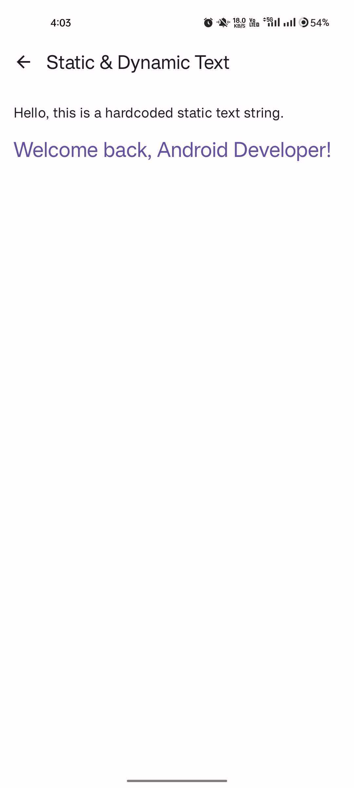 |
| [**2. Clickable Views & Interaction Sinks**](app/src/main/java/com/anshul1507/composesamplefirst/practice/ui/screens/general/ClickableScreen.kt) | Interactive execution states using `Modifier.clickable`, accessibility management (`enabled` flags), and handling silent inputs via `MutableInteractionSource`. | 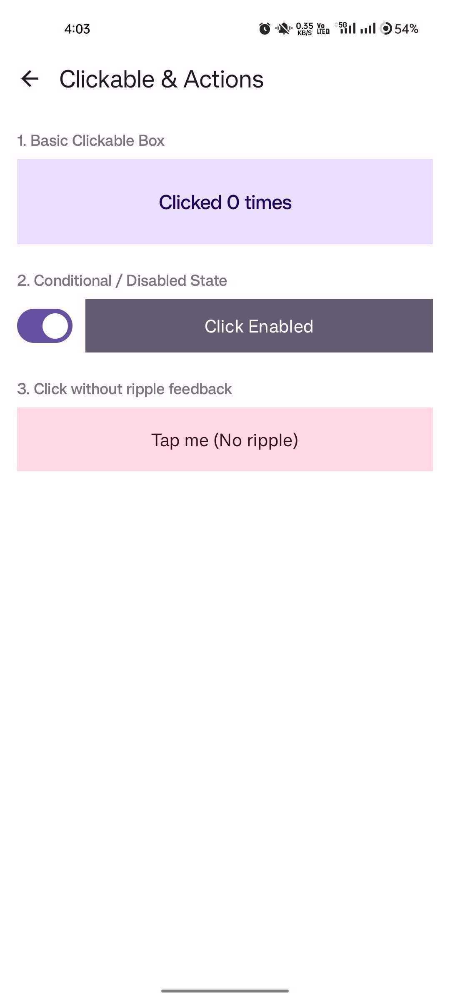 |
| [**3. Layout Modifiers Engine**](app/src/main/java/com/anshul1507/composesamplefirst/practice/ui/screens/general/LayoutModifiersScreen.kt) | Spacing systems via sequential order-of-execution modifiers, floating visual layers (`.offset()`), and locking aspect dimensions using `.aspectRatio()`. | 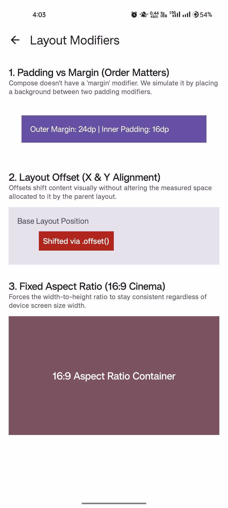 |
| [**4. Backgrounds & Canvas Surfaces**](app/src/main/java/com/anshul1507/composesamplefirst/practice/ui/screens/general/BackgroundColorScreen.kt) | Painting solid container vectors, implementing linear gradient design brushes, and using semantic, dark-mode aware `Surface` nodes. |  |
| [**5. FrameLayout Layering Stacks**](app/src/main/java/com/anshul1507/composesamplefirst/practice/ui/screens/general/BoxStackingScreen.kt) | Building overlapping layouts inside a `Box`, positioning components with explicit child alignments, and optimizing bounds via `matchParentSize()`. | 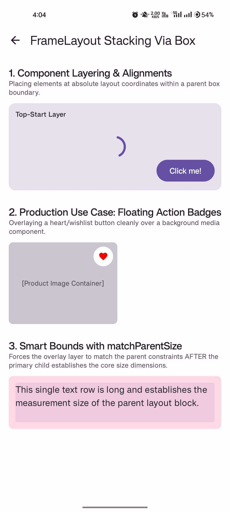 |
| [**6. Micro-Interactions & Animations**](app/src/main/java/com/anshul1507/composesamplefirst/practice/ui/screens/general/AnimationBasicsScreen.kt) | State-driven UI updates using lifecycle-aware `rememberInfiniteTransition` loops and smooth value-driven `animateColorAsState` transitions. |  |
| [**7. System Theme & Dark Mode Config**](app/src/main/java/com/anshul1507/composesamplefirst/practice/ui/screens/general/ThemeModeScreen.kt) | Monitoring system theme flags using `isSystemInDarkTheme()`, preventing hardcoded hex maps, and applying localized theme overrides inline. | 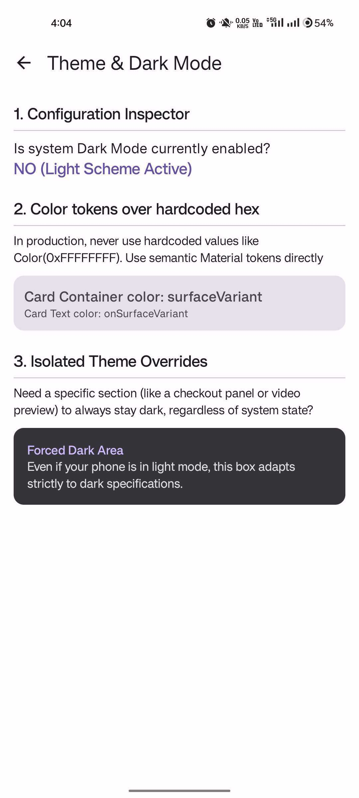 |
| [**8. Immersive Edge-to-Edge Windows**](app/src/main/java/com/anshul1507/composesamplefirst/practice/ui/screens/general/EdgeToEdgeScreen.kt) | Drawing directly behind the OS system status and bottom navigation layers using `enableEdgeToEdge()` and core `WindowInsets` configurations. | 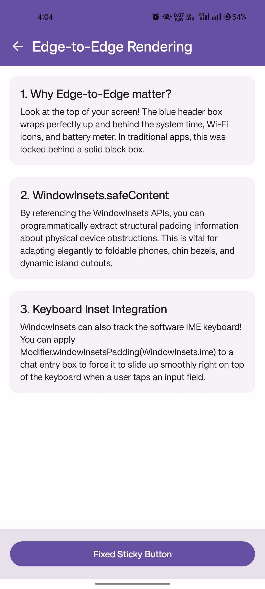 |

---

## 📱 Module 2: State Management & Side-Effects

This module deep-dives into the mechanics of data flow, lifecycle-aware stream collection, state preservation, and asynchronous side-effect pipelines. Click on any example link to view its core source code implementation.

### Architectural Feature Index

| Example Feature | Technical Concept Covered | Screen Preview |
| :--- | :--- | :--- |
| [**1. Local State Mutation**](app/src/main/java/com/anshul1507/composesamplefirst/practice/ui/screens/stateManagement/LocalStateExample.kt) | Storing and mutating UI-bound variables locally within a composable execution scope using remember and state subscription properties. | 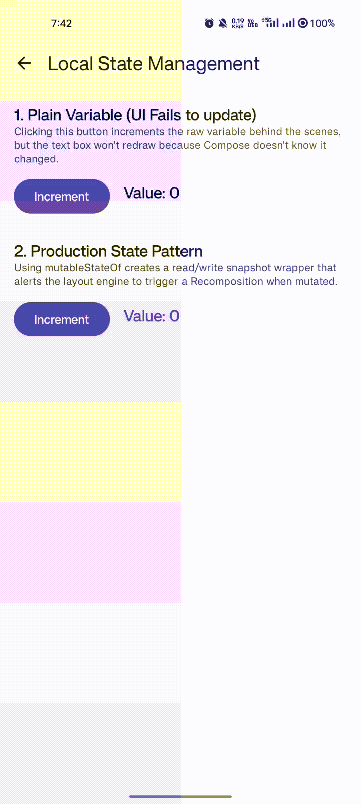 |
| [**2. Configuration Survival**](app/src/main/java/com/anshul1507/composesamplefirst/practice/ui/screens/stateManagement/SaveableStateScreen.kt) | Preserving runtime user input or navigation data layers across screen orientation flips and system-driven Process Death using Bundle serialization. |  |
| [**3. ViewModel & LiveData**](app/src/main/java/com/anshul1507/composesamplefirst/practice/ui/screens/stateManagement/ViewModelLiveScreen.kt) | Decoupling complex business logic architectures and converting traditional Android architecture legacy streams into reactive Compose snapshots. | 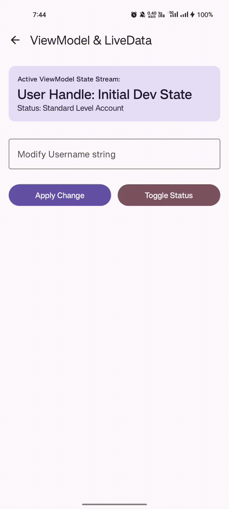 |
| [**4. StateFlow Async Collection**](app/src/main/java/com/anshul1507/composesamplefirst/practice/ui/screens/stateManagement/FlowCollectionScreen.kt) | Consuming asynchronous Flow streams via foreground-aware collectors that automatically pause tracking when the app is backgrounded. | 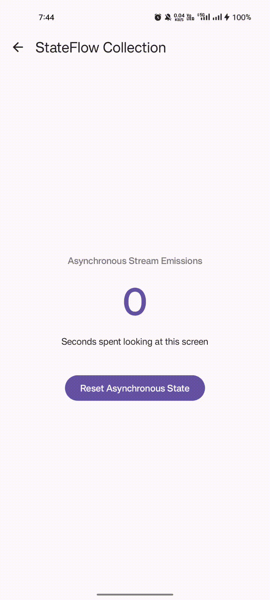 |
| [**5. Side-Effects & Coroutines**](app/src/main/java/com/anshul1507/composesamplefirst/practice/ui/screens/stateManagement/SideEffectsScreen.kt) | Safely executing asynchronous suspending jobs on screen load entry and bridging background coroutine tasks to standard UI user touch listener clicks. | 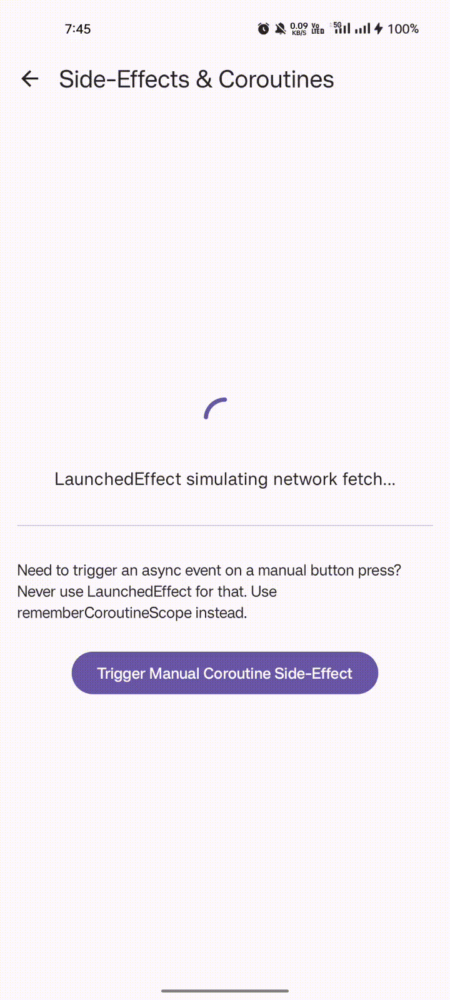 |
| [**6. System Back Interception**](app/src/main/java/com/anshul1507/composesamplefirst/practice/ui/screens/stateManagement/BackHandlerScreen.kt) | Intercepting, halting, and custom handling device hardware buttons or gesture system back swipes to protect unsaved user form entries. |  |
| [**7. State Hoisting Patterns**](app/src/main/java/com/anshul1507/composesamplefirst/practice/ui/screens/stateManagement/StateHoistingScreen.kt) | Refactoring stateful views into pure presentation widgets to build single-source-of-truth architectures that follow clean Unidirectional Data Flow (UDF). | 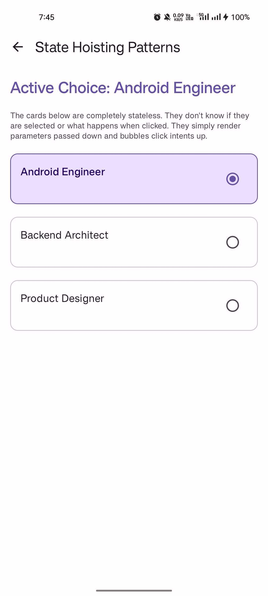 |

---

## 📱 Module 3: Material Design Components

This module focuses on implementing standardized Material Design 3 interactive components, anchoring primary navigation elements, and configuring structural visual aesthetics like shadows, elevations, and responsive wrapping rows. Click on any example link to view its core source code implementation.

### Architectural Feature Index

| Example Feature | Technical Concept Covered | Screen Preview |
| :--- | :--- | :--- |
| [**1. Cards & Progress Metrics**](app/src/main/java/com/anshul1507/composesamplefirst/practice/ui/screens/components/MaterialComponentsScreen.kt) | Designing elevated content surfaces using M3 shape tokens and tracking background operations with Linear and Circular Progress Bars. | 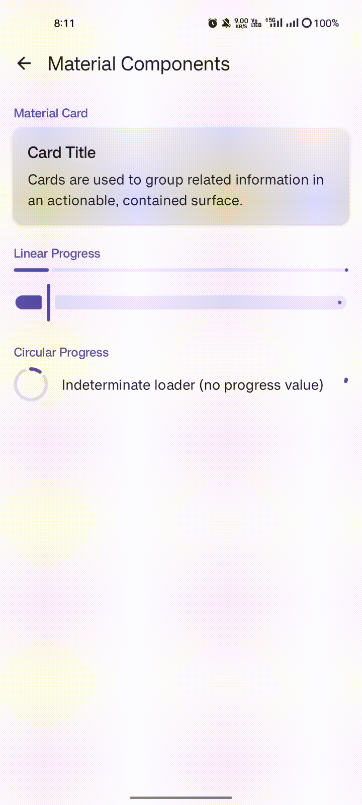 |
| [**2. Dynamic Action Snackbars**](app/src/main/java/com/anshul1507/composesamplefirst/practice/ui/screens/components/SnackbarActionScreen.kt) | Spawning short-lived, asynchronous floating notifications containing contextual single-click action execution listeners. | 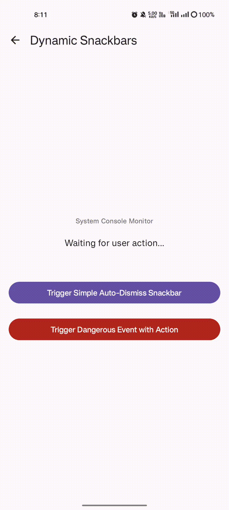 |
| [**3. Continuous & Discrete Sliders**](app/src/main/java/com/anshul1507/composesamplefirst/practice/ui/screens/components/SliderScreen.kt) | Creating range-selection bars that read granular floats or snap explicitly to predetermined mathematical interval ticks. | 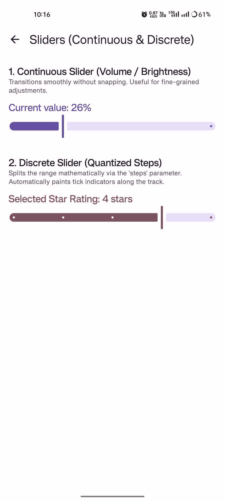 |
| [**4. Multi-State Checkboxes**](app/src/main/java/com/anshul1507/composesamplefirst/practice/ui/screens/components/CheckboxScreen.kt) | Managing selection toggles across traditional two-state flags and highly complex parent-child tri-state (indeterminate) logic. | 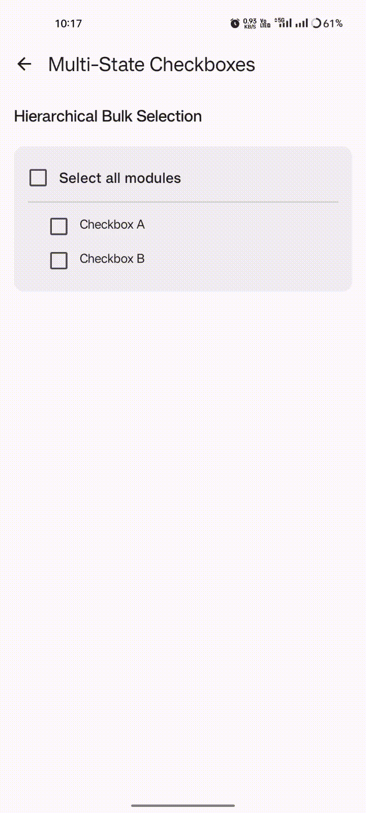 |
| [**5. Radio Button Selection Groups**](app/src/main/java/com/anshul1507/composesamplefirst/practice/ui/screens/components/RadioButtonScreen.kt) | Grouping multiple exclusive choice items to enforce single-source-of-truth validation checks within interactive user forms. | 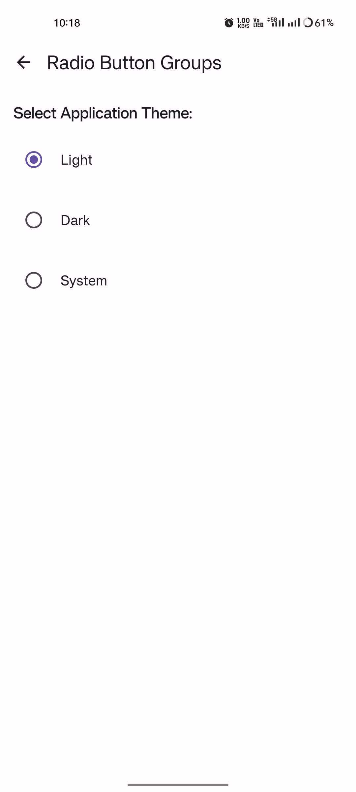 |
| [**6. Floating Action Buttons (FAB)**](app/src/main/java/com/anshul1507/composesamplefirst/practice/ui/screens/components/FabScreen.kt) | Elevating dominant screen-level calls-to-action utilizing standard, small, large, and extended FAB variations anchored over layout layers. | 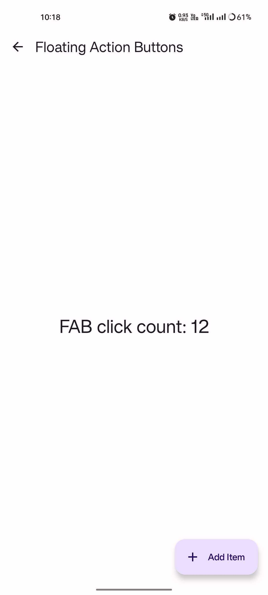 |
| [**7. Bottom Navigation Architecture**](app/src/main/java/com/anshul1507/composesamplefirst/practice/ui/screens/components/BottomNavScreen.kt) | Engineering stable primary application routing using standard M3 NavigationBar shells and stateful item indicators. | 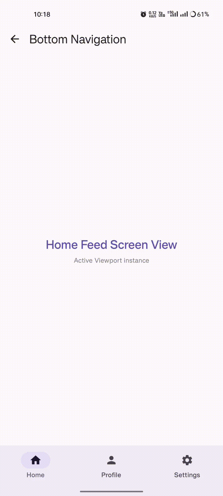 |
| [**8. Sliding Navigation Drawers**](app/src/main/java/com/anshul1507/composesamplefirst/practice/ui/screens/components/NavDrawerScreen.kt) | Building structural side menus supporting modal overlay interactions for mobile sheets and dismissible margins for tablets. | 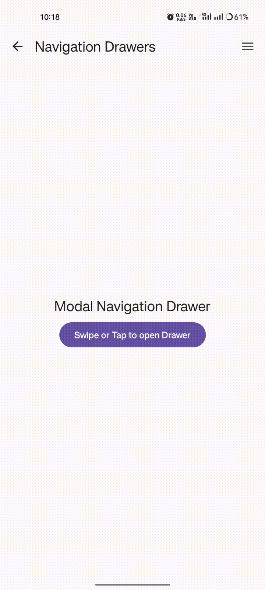 |
| [**9. Custom Interaction Ripples**](app/src/main/java/com/anshul1507/composesamplefirst/practice/ui/screens/components/CustomRippleScreen.kt) | Overriding default click feedback patterns globally or locally inside layout trees using explicit LocalRippleConfiguration injectors. | 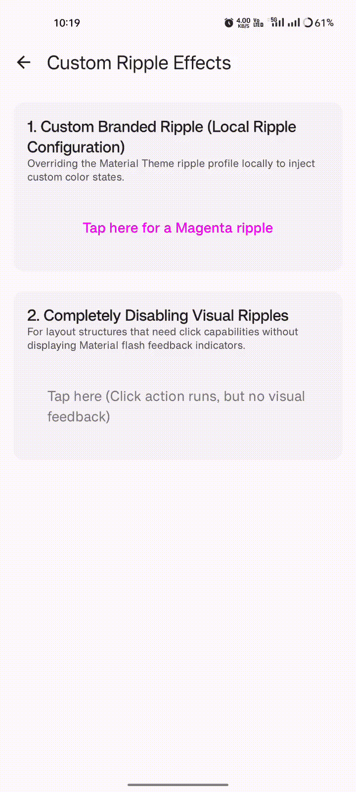 |
| [**10. Standard & Filled Buttons**](app/src/main/java/com/anshul1507/composesamplefirst/practice/ui/screens/components/ButtonStylingScreen.kt) | Styling high-emphasis buttons and implementing click blocking states to safely halt multi-tap network duplication exploits. | 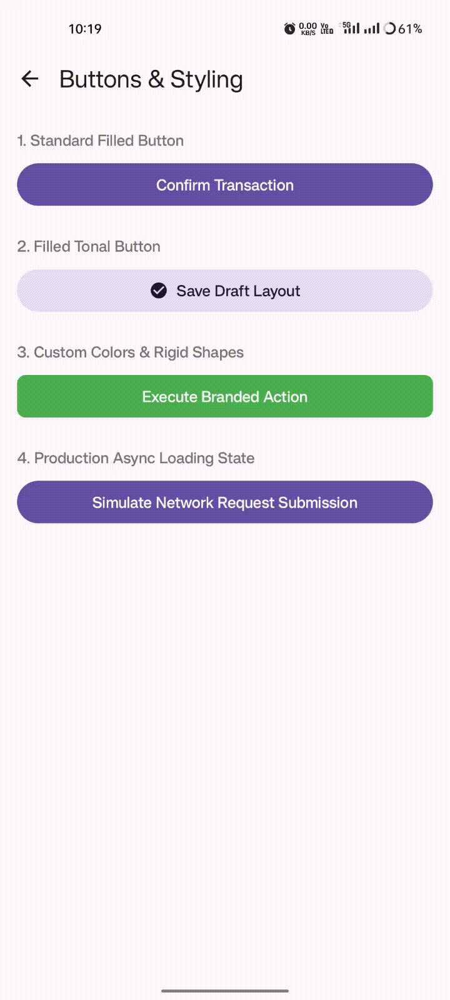 |
| [**11. Alert Dialogs & Popups**](app/src/main/java/com/anshul1507/composesamplefirst/practice/ui/screens/components/DialogsScreen.kt) | Mounting conditional Material 3 AlertDialog nodes and crafting unbounded, raw popup canvases from scratch. | 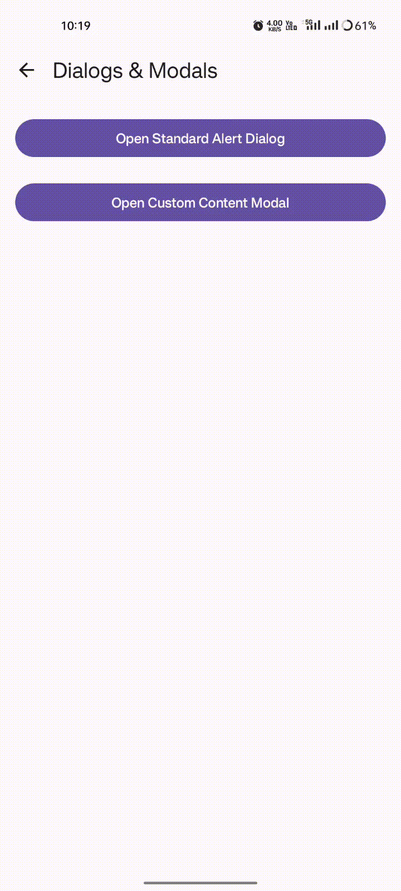 |
| [**12. Wrapping Filter Chips**](app/src/main/java/com/anshul1507/composesamplefirst/practice/ui/screens/components/FilterChipsScreen.kt) | Harnessing ContextualFlowRow layout properties to build responsive, fluid tag grids that automatically overflow cleanly across rows. | 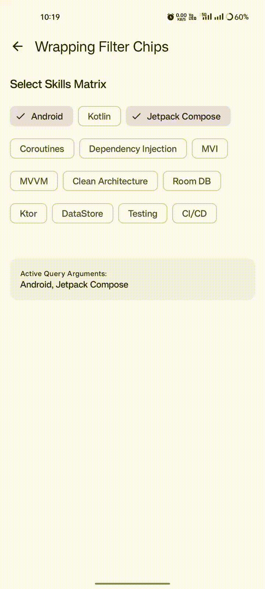 |
| [**13. Custom Shadows & Elevation**](app/src/main/java/com/anshul1507/composesamplefirst/practice/ui/screens/components/CustomShadowScreen.kt) | Bypassing default hardware boundaries by utilizing low-level native framework paints to draw soft, colored skeuomorphic shadows. | 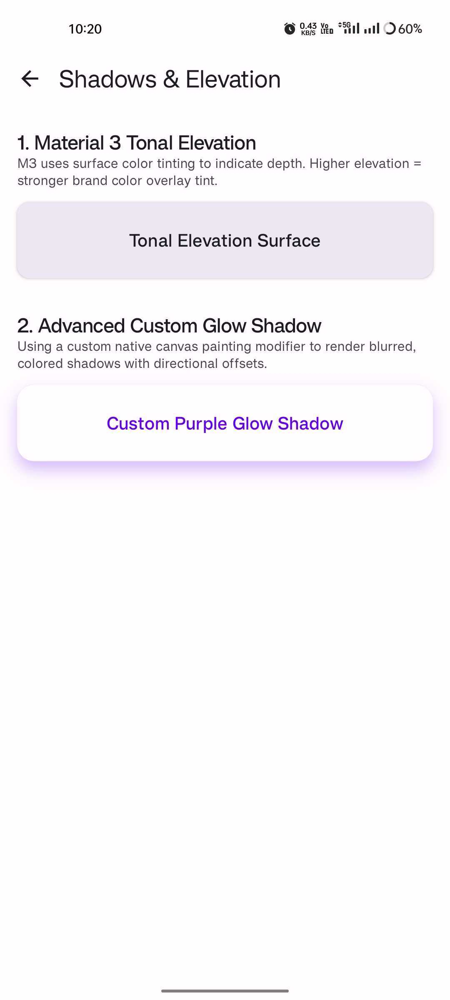 |

---

## 📱 Module 4: Typography Advanced

This module focuses on implementing standardized Material Design 3 interactive components, anchoring primary navigation elements, and configuring structural visual aesthetics like shadows, elevations, and responsive wrapping rows. Click on any example link to view its core source code implementation.

### Architectural Feature Index

| Example Feature | Technical Concept Covered | Screen Preview |
| :--- | :--- | :--- |
| [**1. Advanced Typography & Fonts**](app/src/main/java/com/anshul1507/composesamplefirst/practice/ui/screens/typographyAndAdvancedText/TypographyAdvancedScreen.kt) | Custom font family loading, mixed fontweight layout arrangements, and rich text spans contained within a single text element baseline pass. | 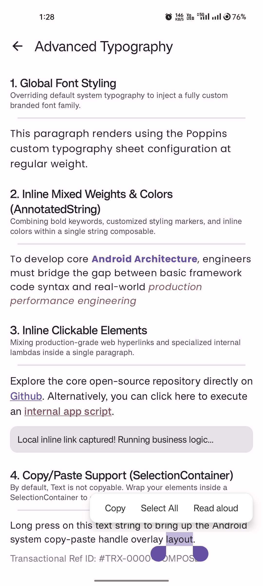 |
| [**2. Custom TextFields & Inputs**](app/src/main/java/com/anshul1507/composesamplefirst/practice/ui/screens/typographyAndAdvancedText/TextFieldCustomScreen.kt) | State-controlled custom form fields, handling error state boundaries, input parameters validation, and launching specialized numeric input panels. | 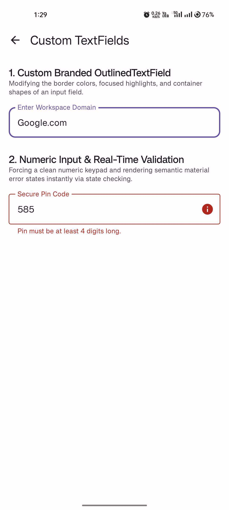 |
| [**3. Search Bars & Filtering**](app/src/main/java/com/anshul1507/composesamplefirst/practice/ui/screens/typographyAndAdvancedText/SearchBarScreen.kt) | Implementing standardized Material 3 SearchBars paired with real-time state query filters and floating history expansion blocks. | 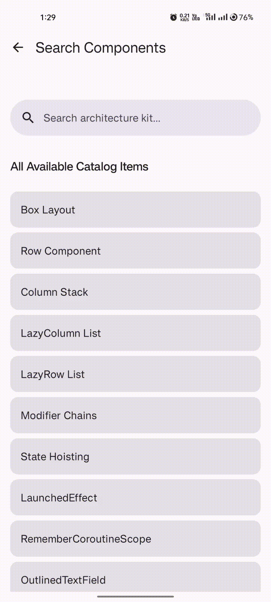 |
| [**4. Visual Transformations**](app/src/main/java/com/anshul1507/composesamplefirst/practice/ui/screens/typographyAndAdvancedText/VisualTransformationScreen.kt) | Applying input text manipulation layers (VisualTransformation) to format raw text fields into credit card block grouping and secure password characters. | 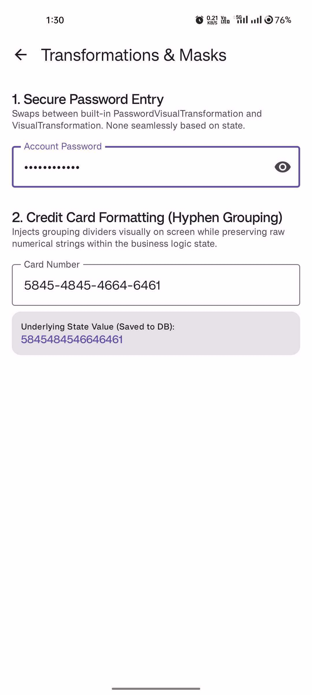 |
| [**5. Inline Text Animations**](app/src/main/java/com/anshul1507/composesamplefirst/practice/ui/screens/typographyAndAdvancedText/AnimatedTextInlineScreen.kt) | Animating layout transitions for text nodes or dynamically swapping out components cleanly inside a running text layout. | 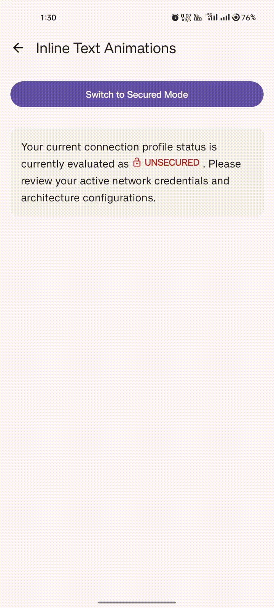 |

---

## 📱 Module 5: Viewport Virtualization & Infinite Lists

This module explores high-performance viewport virtualization using the Lazy layout ecosystem, covering everything from granular scroll telemetry and adaptive structural grids to infinite list pagination using Paging 3. Click on any example link to view its core source code implementation.

### Architectural Feature Index

| Example Feature | Technical Concept Covered | Screen Preview |
| :--- | :--- | :--- |
| [**1. Vertical LazyColumn Lists**](app/src/main/java/com/anshul1507/composesamplefirst/practice/ui/screens/lists/LazyColumnScreen.kt) | High-performance vertical list virtualization equivalent to RecyclerView, utilizing unique item layout keys and explicit content type tracking parameters. |  |
| [**2. Horizontal Carousels**](app/src/main/java/com/anshul1507/composesamplefirst/practice/ui/screens/lists/LazyRowScreen.kt) | Building fluid, horizontally scrollable content rows, snapping view containers, and dashboard item carousel streams using LazyRow components. | 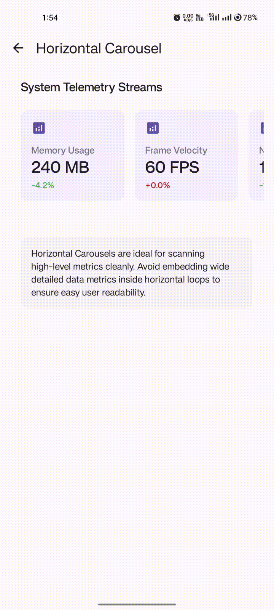 |
| [**3. Adaptive Spanning Grids**](app/src/main/java/com/anshul1507/composesamplefirst/practice/ui/screens/lists/LazyGridScreen.kt) | Implementing non-uniform grid matrices using LazyVerticalGrid while mapping custom responsive column cell spanning constraints. | 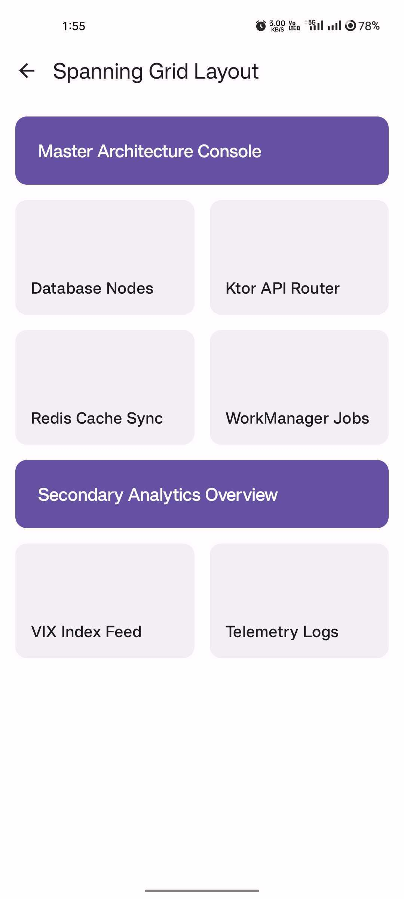 |
| [**4. Sticky Category Headers**](app/src/main/java/com/anshul1507/composesamplefirst/practice/ui/screens/lists/StickyHeaderScreen.kt) | Using the experimental stickyHeader compilation block to engineer categorized list panels with section headers that pin fluidly to the top edge of the screen. | 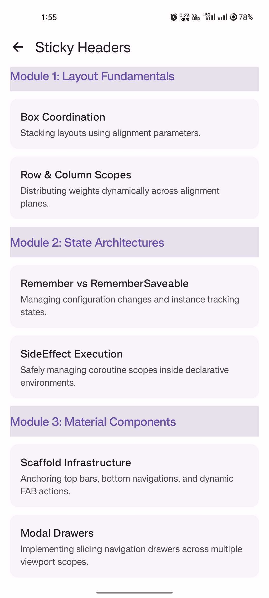 |
| [**5. Scroll State Metrics**](app/src/main/java/com/anshul1507/composesamplefirst/practice/ui/screens/lists/ScrollInterceptionScreen.kt) | Interacting directly with the LazyListState tracking engine to capture scrolling speed vector changes, track visible viewport indices, and drive smart UI actions. |  |
| [**6. Animated List Mutations**](app/src/main/java/com/anshul1507/composesamplefirst/practice/ui/screens/lists/ListAnimationScreen.kt) | Utilizing the standard `Modifier.animateItem()` framework modifier parameters to execute layout transitions for virtualized item index insertions, deletions, and swaps. |  |
| [**7. Paging 3 Infinite Scroll**](app/src/main/java/com/anshul1507/composesamplefirst/practice/ui/screens/lists/InfiniteScrollScreen.kt) | Integrating the official Jetpack Paging 3 architecture framework with LazyColumn to build a real-time cursor-paginated infinite scroll layout network pipeline. |  |

---

## 📱 Module 6: Media, Asynchronous Graphics & Video Playback

This module focuses on loading, caching, and optimizing local and remote visual media, rendering loading skeleton configurations, and hosting native video playback pipelines. Click on any example link to view its core source code implementation.

### Architectural Feature Index

| Example Feature | Technical Concept Covered | Screen Preview |
| :--- | :--- | :--- |
| [**1. Static Images & Vector Tinting**](app/src/main/java/com/anshul1507/composesamplefirst/practice/ui/screens/media/StaticImageScreen.kt) | Working with local PNG/JPEG assets, applying XML vector tint overlays, shape-masking clipping, and handling ContentScale configuration profiles. | 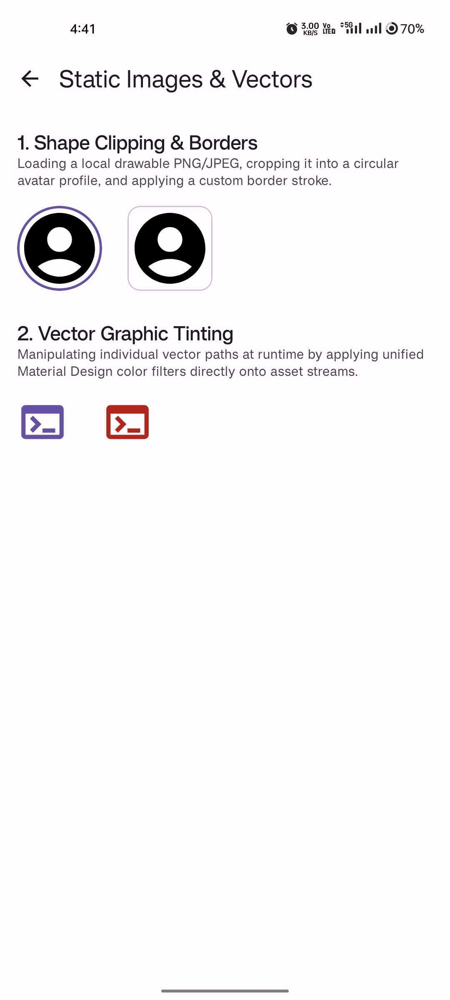 |
| [**2. Network Images via Coil**](app/src/main/java/com/anshul1507/composesamplefirst/practice/ui/screens/media/NetworkImageScreen.kt) | Asynchronous image loading using the Coil engine, managing asset decoding pipelines, and implementing smooth transition crossfades on success. | 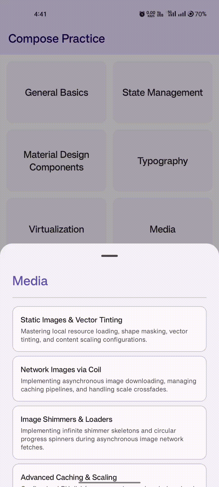 |
| [**3. Image Shimmers & Loaders**](app/src/main/java/com/anshul1507/composesamplefirst/practice/ui/screens/media/ImageLoaderScreen.kt) | Designing infinite linear gradient animation shimmers and progress placeholders to serve as elegant structural skeleton screens while remote networks fetch. | 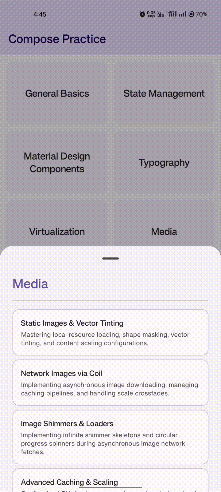 |
| [**4. Advanced Caching & Scaling**](app/src/main/java/com/anshul1507/composesamplefirst/practice/ui/screens/media/ImageCachingScreen.kt) | Constructing dual-layer LRU (Least Recently Used) disk and memory caching layers paired with explicit matrix coordinates crop scaling optimization. | 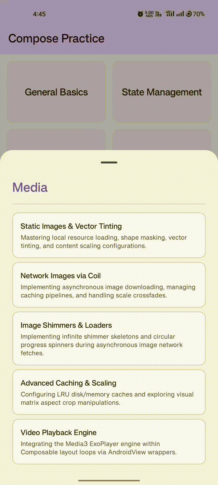 |
| [**5. Video Playback Engine**](app/src/main/java/com/anshul1507/composesamplefirst/practice/ui/screens/media/VideoPlaybackScreen.kt) | Embedding the Media3 ExoPlayer kernel architecture within Compose view trees using AndroidView nodes to run background-buffered hardware video render paths. |  |

---

## 📱 Module 7: Advanced Layout Engineering & Constraint Ecosystems

This module explores complex UI structures, flat hierarchy layouts using ConstraintLayout primitives, adaptive runtime rule adjustments, and structural pre-calculation passes using Intrinsic Measurements. Click on any example link to view its core source code implementation.

### Architectural Feature Index

| Example Feature | Technical Concept Covered | Screen Preview |
| :--- | :--- | :--- |
| [**1. Flexible Layouts & Flexbox Rules**](app/src/main/java/com/anshul1507/composesamplefirst/practice/ui/screens/layouts/FlexboxLayoutScreen.kt) | Managing relative item weights across multi-layered flows, utilizing Flexbox grouping arrangements, and forcing cross-component text baseline alignments. | 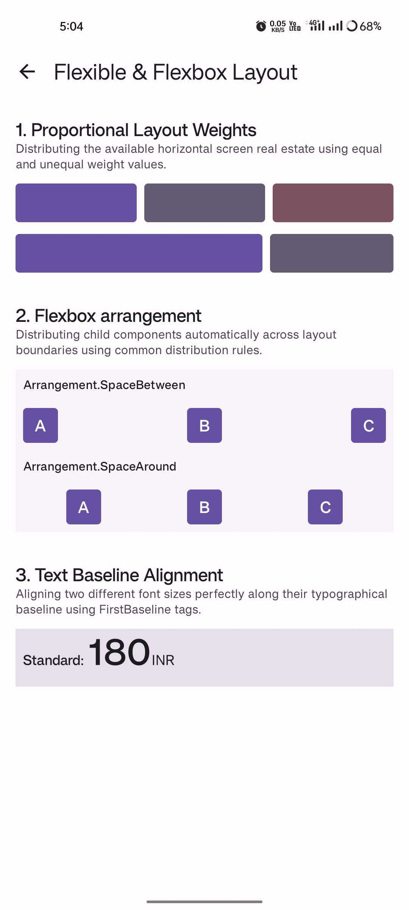 |
| [**2. ConstraintLayout Primitives**](app/src/main/java/com/anshul1507/composesamplefirst/practice/ui/screens/layouts/ConstraintLayoutScreen.kt) | Building complex flat screen hierarchies using decoupled inline references, virtual tracking Guidelines, responsive Barriers, and positional Bias layout vectors. | 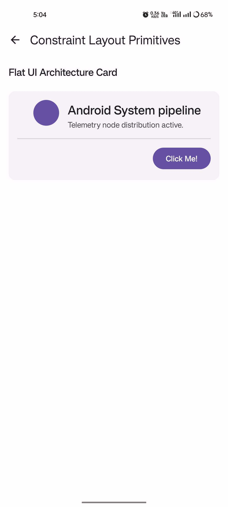 |
| [**3. Adaptive Decoupled Layouts**](app/src/main/java/com/anshul1507/composesamplefirst/practice/ui/screens/layouts/AdaptiveConstraintsScreen.kt) | Separating complete design ConstraintSet profiles from structural view code blocks and parsing real-time available space via BoxWithConstraints wrappers. | 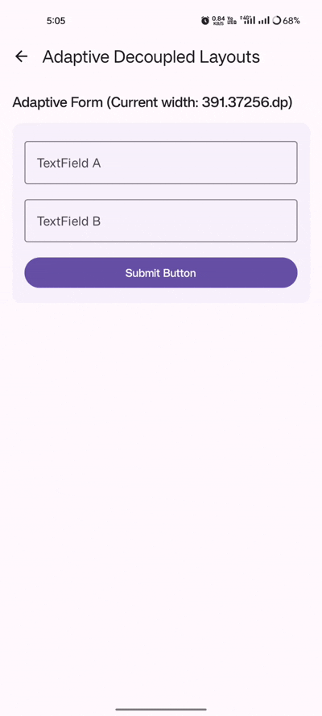 |
| [**4. Intrinsic Measurements**](app/src/main/java/com/anshul1507/composesamplefirst/practice/ui/screens/layouts/IntrinsicLayoutScreen.kt) | Querying and synchronizing the natural, raw minimum and maximum dimensions of sibling child components before executing the final screen layout rendering pass. | 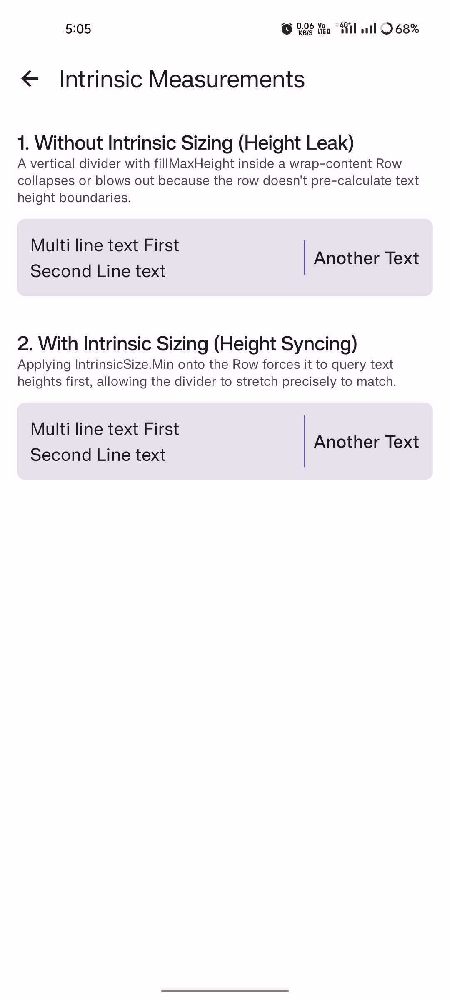 |

---

## 📱 Module 8: Custom Drawing, Canvas Graphics & Gestures

This module drops down past standard UI layouts into low-level rendering loops, low-level multi-touch pointer tracking, hardware-accelerated transformation layers, and math-driven drawing canvases. Click on any example link to view its core source code implementation.

### Architectural Feature Index

| Example Feature | Technical Concept Covered | Screen Preview |
| :--- | :--- | :--- |
| [**1. Canvas & Geometric Shapes**](app/src/main/java/com/anshul1507/composesamplefirst/practice/ui/screens/customDrawing/CanvasDrawingScreen.kt) | Working with the drawing Canvas API, building vector graphics paths, drawing complex geometric shapes, and applying linear and radial gradient shader sweeps. | 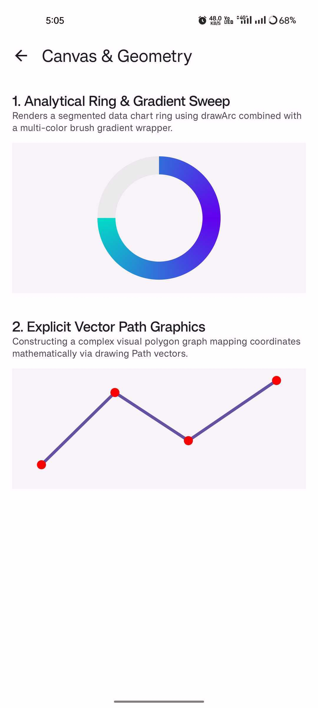 |
| [**2. Interactive Measuring Scale**](app/src/main/java/com/anshul1507/composesamplefirst/practice/ui/screens/customDrawing/MeasuringScaleScreen.kt) | Building custom calibrations via math-driven coordinate calculations, handling dynamic text tick rendering, and combining canvas loops with manual drag gestures. | 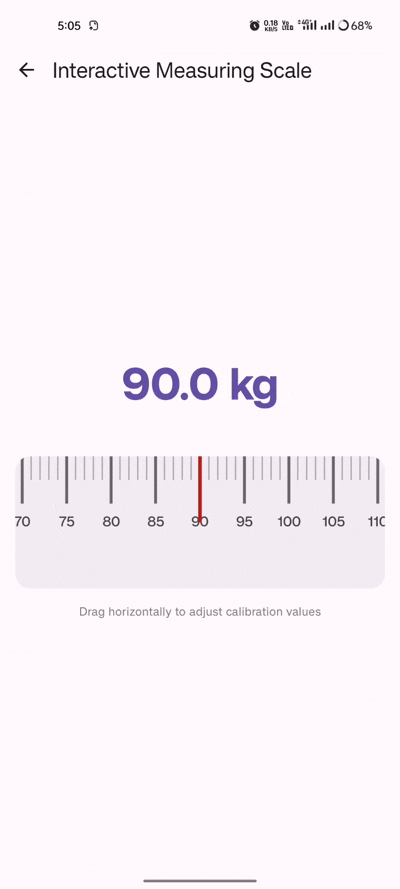 |
| [**3. Multi-Touch Zoom & Pan**](app/src/main/java/com/anshul1507/composesamplefirst/practice/ui/screens/customDrawing/ZoomPanScreen.kt) | Implementing hardware-accelerated graphicsLayer transformation matrices to support fluid pinch-to-zoom multi-finger scaling and translation drag panning. | 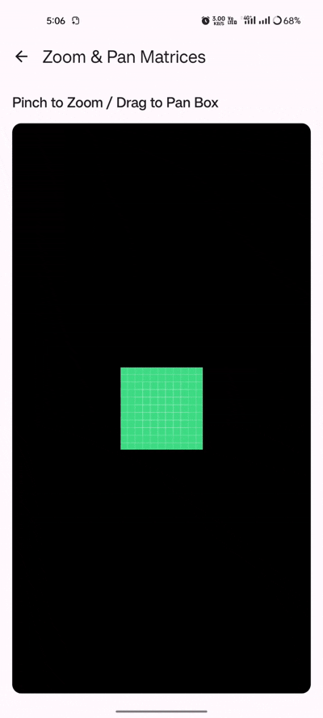 |
| [**4. Raw Pointer Paint Canvas**](app/src/main/java/com/anshul1507/composesamplefirst/practice/ui/screens/customDrawing/PaintCanvasScreen.kt) | Intercepting primitive hardware input touch arrays using low-level awaitPointerEventScope listeners to build a real-time digital sketch pad. |  |

---

## 📱 Module 9: Production Architecture, Enterprise Navigation & Interoperability

This module covers clean architecture patterns for production codebases, type-safe navigation handling using modern Kotlin Serialization targets, embedding legacy View systems via platform interop layers, and setting up dependency injection graphs with Hilt. Click on any example link to view its core source code implementation.

### Architectural Feature Index

| Example Feature | Technical Concept Covered | Screen Preview |
| :--- | :--- | :--- |
| [**1. Type-Safe Navigation Framework**](app/src/main/java/com/anshul1507/composesamplefirst/practice/ui/screens/architecture/TypeSafeNavigationScreen.kt) | Constructing compile-time safe destination routers using Kotlin Serialization schemas to pass complex argument parameters without relying on fragile string keys. | 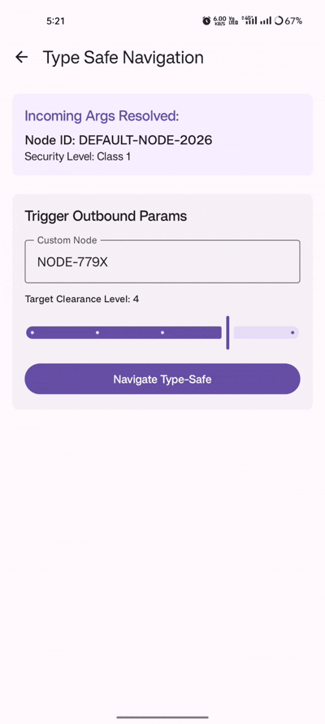 |
| [**2. Legacy View Interoperability**](app/src/main/java/com/anshul1507/composesamplefirst/practice/ui/screens/architecture/ViewInteroperableScreen.kt) | Embedding classic platform Views (like a hardware-accelerated WebView) inside Compose layout trees using AndroidView, handling lifecycle bindings, and displaying overlay loaders. | 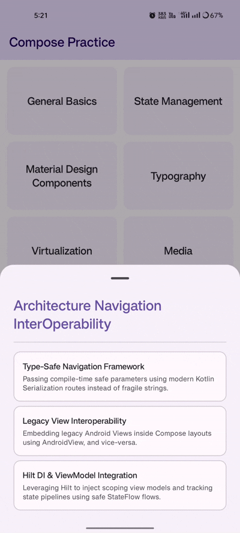 |
| [**3. Hilt DI & ViewModel Integration**](app/src/main/java/com/anshul1507/composesamplefirst/practice/ui/screens/architecture/HiltInjectScreen.kt) | Setting up an application-wide dependency container graph with Hilt, injecting lifecycle-scoped ViewModels via `hiltViewModel()`, and exposing UI state as observable StateFlows. | 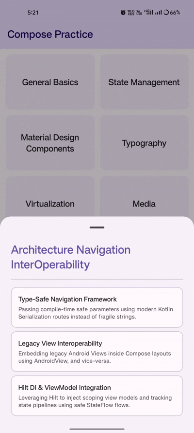 |

---
---


## 📂 Project Structure Directory

To keep the repository clean and scalable for subsequent learning modules, the codebase uses a structured package arrangement:

```text
app/src/main/java/com/anshul1507/composesamplefirst/practice/
│
├── data/
│   └── FeatureRegistry.kt       <-- Centralized Single Source of Truth for feature indexing
│
├── navigation/
│   ├── Routes.kt                <-- Kotlinx @Serializable compile-time safe navigation routes
│   └── NavGraph.kt              <-- Master AppNavGraph orchestration hub
│
├── ui/
│   ├── screens/
│   │   ├── DashboardScreen.kt   <-- Dynamic LazyColumn landing launch menu
│   │   └── general/             <-- Module 1 code files (SimpleText, Clickable, Box, etc.)
│   │   └── stateManagement/     <-- Module 2 code files (LocalState, StateHoisting, ViewModel, etc.)
│   │   └── components/          <-- Module 3 code files (Cards, Button Styling, SnackBar, Drawer, etc.)
│   │   └── typographyAndAdvancedText/  <-- Module 4 code files (Typography, TextField, Search, Mask, etc.)
│   │   └── virtualization/      <-- Module 5 code files (Lazy Column, Carousel, Infinite Scrolling etc.)
│   │   └── media/               <-- Module 6 code files (Network Image, Shimmer, Video Playback etc.)
│   │   └── layouts/             <-- Module 7 code files (Flexbox, Constraint Layout etc.)
│   │   └── customDrawing/       <-- Module 8 code files (Canvas, Zoom in, Drag etc.)
│   │   └── architecture/        <-- Module 9 code files (Navigation, Legacy View Interoperability etc.)
│   │
│   └── theme/
│       ├── Color.kt             <-- Hex definitions for Light & Dark spectrums
│       ├── Theme.kt             <-- MaterialTheme wrapper orchestration
│       └── Type.kt              <-- Global Typography token configurations
│
└── ActivityMain.kt              <-- App initialization layer & setContent {} anchor
```
---

## 🏃 Setup & Installation Guide

Clone this repository directly onto your local machine:

Bash
```text
git clone https://github.com/Anshul1507/ComposeSampleFirst.git
```
* Open the project inside Android Studio (Koala or newer recommended).

* Ensure you have JDK 17 or JDK 21 selected in your Android Studio Gradle execution environments.

* Let the Gradle project sync automatically using the specified libs.versions.toml version catalog.

* Click Run (Shift + F10) to deploy the production application directly onto your target test simulator or physical hardware!
---

## 📅 Roadmap Lifecycle

[x] Module 1: General Basics, Core Layouts & Structural Modifiers (100% Completed)

[x] Module 2: State Management Architecture, Side-Effects, and ViewModels (100% Completed)

[x] Module 3: Rich Material Design Components & Layout Engineering (100% Completed)

[x] Module 4: Typography & Advanced Text (100% Completed)

[x] Module 5: Viewport Virtualization & Infinite Lists (100% Completed)

[x] Module 6: Media, Asynchronous Graphics & Video Playback (100% Completed)

[x] Module 7: Advanced Layout Engineering & Constraint Ecosystems (100% Completed)

[x] Module 8: Custom Drawing, Canvas Graphics & Gestures (100% Completed)

[x] Module 9: Production Architecture, Enterprise Navigation & Interoperability (100% Completed)

Feel free to star ⭐ this repository if you find these practical implementations helpful for your Compose journey! Contributions, issue reports, or layout optimization suggestions are always welcome.

License
-----------------

    Copyright 2026 Anshul Gupta

    Licensed under the Apache License, Version 2.0 (the "License");
    you may not use this file except in compliance with the License.
    You may obtain a copy of the License at

       http://www.apache.org/licenses/LICENSE-2.0

    Unless required by applicable law or agreed to in writing, software
    distributed under the License is distributed on an "AS IS" BASIS,
    WITHOUT WARRANTIES OR CONDITIONS OF ANY KIND, either express or implied.
    See the License for the specific language governing permissions and
    limitations under the License.
